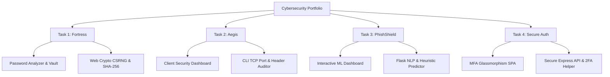

# 🛡️ Cybersecurity Engineering Portfolio

Welcome to the **Cybersecurity Engineering Portfolio**. This repository contains a curated collection of production-grade security applications, automated auditing tools, machine learning-powered threat detectors, and secure full-stack authentication systems. 

Each component is designed following industry-standard secure coding practices, cryptography guidelines, and threat mitigation paradigms.

---

## 🗺️ Portfolio Overview

This workspace is structured into four distinct cybersecurity engineering tasks, moving from client-side cryptographic suites to advanced full-stack systems:



### Quick Reference Matrix

| Project / Task | Type | Primary Technology Stack | Key Security / Cryptographic Concepts |
| :--- | :--- | :--- | :--- |
| **[Task 1: Fortress](file:///d:/Cybersecurity%20intern%20project/task1/)** | Client-Side Suite | HTML5, Vanilla CSS3, Web Crypto API | Shannon Entropy, CSRNG, SHA-256 Hashing, Credential Stuffing Mitigation |
| **[Task 2: Aegis](file:///d:/Cybersecurity%20intern%20project/task2/)** | Auditing Tool & CLI | HTML5, CSS3, Python (Socket/HTTP) | Client Sandbox Auditing, Banner Grabbing, Vulnerability Cross-Referencing, Security Headers Audit |
| **[Task 3: PhishShield](file:///d:/Cybersecurity%20intern%20project/task3/)** | AI Threat Detection | Flask, Scikit-Learn, Joblib, JS | NLP TF-IDF Representation, Heuristic Feature Extraction, Real-Time Model Retraining |
| **[Task 4: Secure Auth](file:///d:/Cybersecurity%20intern%20project/task4/)** | Full-Stack Identity | Node.js (Express), SQLite, Speakeasy | SQLi & Clickjacking Protections, Bcrypt Hashing, Session Controls, TOTP Multi-Factor Auth |

---

## 📁 Repository Directory Structure

Below is the directory tree mapping the security components across all tasks:

```text
Cybersecurity intern project/
├── README.md               # Portfolio root documentation (This file)
├── task1/                  # Fortress: Password Security Suite
│   ├── index.html          # Web application interface
│   ├── styles.css          # Glassmorphism visual theme
│   ├── app.js              # Crypto logic & calculations
│   └── README.md           # Task 1 specific documentation
├── task2/                  # Aegis: Vulnerability Scanner & Security Auditor
│   ├── index.html          # Auditing dashboard interface
│   ├── style.css           # Terminal-style visual assets
│   ├── app.js              # Browser-side analysis logic
│   ├── scanner.py          # Python port & HTTP header auditing CLI
│   └── README.md           # Task 2 specific documentation
├── task3/                  # PhishShield: AI Phishing Detection Model
│   ├── app.py              # Flask server & REST API
│   ├── model.py            # Logistic regression training pipeline
│   ├── dataset.py          # Dataset parsing & generation engine
│   ├── test_model.py       # ML unit testing suite
│   ├── index.html          # Model metrics & prediction interface
│   ├── style.css           # Dynamic dashboard visualizations
│   ├── app.js              # Live metrics & prediction fetcher
│   └── README.md           # Task 3 specific documentation
└── task4/                  # Secure Auth: Advanced MFA Login System
    ├── server.js           # Secure Node.js Express API server
    ├── database.js         # Parameterized SQLite connector
    ├── watch-2fa.js        # Background CLI 2FA testing watcher
    ├── package.json        # Node.json dependency manifest
    ├── public/             # Static SPA login portal assets
    │   ├── index.html      # SPA structure
    │   ├── style.css       # Theme, animations, & transitions
    │   └── app.js          # Authentication and validation routines
    └── README.md           # Task 4 specific documentation
```

---

## 🛠️ Project Deep Dives

### 🛡️ Task 1: Fortress (Password Security Suite)
*   **Location**: [task1/](file:///d:/Cybersecurity%20intern%20project/task1/)
*   **Features**:
    *   **Shannon Entropy Calculator**: Calculates password mathematical complexity in bits.
    *   **Smart Generator**: Cryptographically secure random values (CSRNG) using the Web Crypto API.
    *   **Security Vault Simulator**: Demonstrates one-way SHA-256 hashing database storage and alerts users on password reuse.
*   **Detailed Setup**: See the [task1/README.md](file:///d:/Cybersecurity%20intern%20project/task1/README.md) for usage guides.

### 🛡️ Task 2: Aegis (Vulnerability Scanner & Security Auditor)
*   **Location**: [task2/](file:///d:/Cybersecurity%20intern%20project/task2/)
*   **Features**:
    *   **Browser Auditor**: Audits cookies, HTTPS, and frame sandboxing directly on the client origin.
    *   **Python Network CLI Scanner**: Standalone Python banner grabber, TCP port scanner, and HTTP security header validator.
    *   **Remediation Center**: Code examples demonstrating vulnerable setups vs. mitigated configurations.
*   **Detailed Setup**: See the [task2/README.md](file:///d:/Cybersecurity%20intern%20project/task2/README.md) for CLI options.

### 🛡️ Task 3: PhishShield (AI Phishing Email Detector)
*   **Location**: [task3/](file:///d:/Cybersecurity%20intern%20project/task3/)
*   **Features**:
    *   **Hybrid ML Classifier**: Combines TF-IDF NLP text representations with 6 specialized heuristic security flags (e.g. brand impersonation, urgent markers, masked shorteners).
    *   **Live Retraining Portal**: Input new training data to retrain the model asynchronously, instantly shifting model weights and performance metrics.
    *   **Model Coefficient Charts**: Live visual reports on word weights determining safety or threat scores.
*   **Detailed Setup**: See the [task3/README.md](file:///d:/Cybersecurity%20intern%20project/task3/README.md) to set up the Python environment and run unit tests.

### 🛡️ Task 4: Secure Auth (Advanced Multi-Factor Login System)
*   **Location**: [task4/](file:///d:/Cybersecurity%20intern%20project/task4/)
*   **Features**:
    *   **SQL Injection Prevention**: Parameterized queries mapping inputs isolated from SQLite statements.
    *   **Secure Session Architecture**: Session ID cookies configured with `httpOnly`, `sameSite: 'lax'`, and temporary state flags prior to TOTP.
    *   **speakeasy/2FA**: TOTP-based multi-factor authentication with QR code generation.
    *   **Background 2FA Testing Watcher**: Automatically detects and translates TOTP secrets on the filesystem to speed up testing loops.
*   **Detailed Setup**: See the [task4/README.md](file:///d:/Cybersecurity%20intern%20project/task4/README.md) for dependencies.

---

## ⚙️ Initial Development Environment Setup

To get the complete set of tools up and running:

### 1. Clone the Repository
Ensure you have initialized git and tracked your files:
```bash
git init
git add .
git commit -m "Initial commit of Cybersecurity Intern Portfolio"
```

### 2. Configure Prerequisites
Ensure your workstation has the following runtimes:
*   **Node.js** (v14 or higher)
*   **Python 3.8+**

---

### 3. Running Individual Tasks

#### Task 1 (Fortress) & Task 2 (Aegis Dashboard)
These run directly in the browser. You can serve them using Python's static server:
```bash
# For Task 1
cd task1
python -m http.server 8000

# For Task 2
cd ../task2
python -m http.server 8001
```

#### Task 2 CLI Scanner
Evaluate target endpoints directly from the command-line interface:
```bash
cd task2
python scanner.py localhost -p 22,80,443,8080 -o scan_report
```

#### Task 3 (PhishShield Backend & Dashboard)
Install Python dependencies and start the Flask service:
```bash
cd task3
pip install Flask Flask-CORS pandas scikit-learn joblib numpy scipy
python app.py
```
Visit **[http://127.0.0.1:5000](http://127.0.0.1:5000)** to view the PhishShield operations screen.

Run automated pipeline test suites:
```bash
python test_model.py
```

#### Task 4 (Secure Auth API & SPA Login)
Install package packages and boot the local Node.js Express server:
```bash
cd task4
npm install
npm run dev
```
Navigate your browser to **[http://localhost:3000](http://localhost:3000)**. 

To start the automated 2FA CLI helper:
```bash
node watch-2fa.js
```

---

## ⚠️ Ethical & Legal Disclaimer

> [!WARNING]
> These applications, vulnerability scanners, and simulated databases are designed solely for educational training, academic evaluation, and authorized penetration auditing. Performing port scanning, header inspection, or credential auditing against target systems without the explicit, written consent of the resource owners is illegal. Developers assume no liability for misuse, damages, or regulatory violations arising from this project code.
